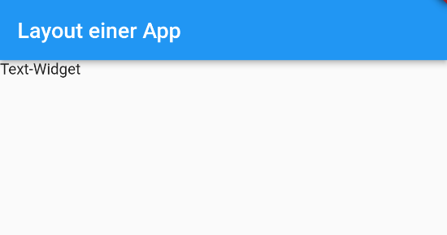
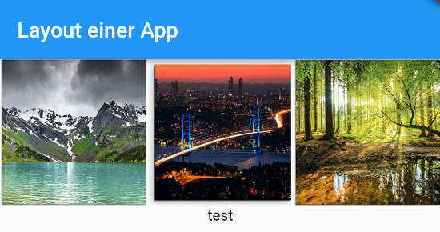
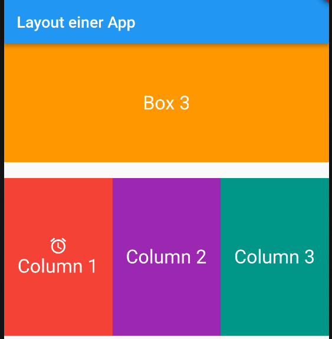

# Grundlagen zu Layout in Flutter
Hier werden die wichtichsten Grundlagen zu Layout in Flutter beschrieben

## Struktur
Innerhalb des MaterialApp-Widgets wird ein Scaffold-Widget verwendet, um die grundlegende Struktur der App zu definieren. Das Scaffold-Widget stellt eine App-Leiste (AppBar) und einen Körper (body) bereit. Die AppBar enthält einen Titel, der mit dem Text-Widget definiert wird und den Wert "Layout einer App" hat. Der Body der App ist derzeit leer und muss mit weiteren Widgets gefüllt werden, um den Inhalt der App darzustellen.

```dart
class MyHomePage extends StatelessWidget {
  @override
  Widget build(BuildContext context) {
    
    return MaterialApp(
      
      home: Scaffold(
        appBar: AppBar(
          title: Text('Layout einer App'),
        ),
        
        body:
        
        

        ),
      );
  }
}

```

## Vorbereitungen
### Bilder einfügen und Icons verwenden
Im Root Verzeichnis legen sie einen Ordner *assets* an und kopieren drei Bilder (hier verfügbar).

Bearbeitung von *pubspec.yaml*
```dart
flutter:
  assets:
  - assets/berg.jpg
  - assets/stadt.jpg
  - assets/wald.jpg

  uses-material-design: true
```

## Grundlagen
Im Body-Bereich wird ein Widget (Text) eingefügt:



```dart
class MyHomePage extends StatelessWidget {
  @override
  Widget build(BuildContext context) {
    
    return MaterialApp(
      
      home: Scaffold(
        appBar: AppBar(
          title: Text('Layout einer App'),
        ),
        
        body:
        
          Text('Text-Widget'),

      ),
    );
  }
}
```

Mit dem Center-Widget wird das Textfeld zentriert:
```dart
        Center(
          child: 
            Text('Text-Widget'),
        )
  
```

Das Center-Widget wird dupliziert und in einem Column Widget dargestellt.

```dart
body:
          Row(
            children: [
              Center(
                child: 
                  Text('Text-Widget'),
              ),
              Center(
                child: 
                  Text('Text-Widget'),
              )

            ],
          ),
   ```
   
  Mit *MainAxisAlignement* zentrieren
  
  ```dart
  Row(
            mainAxisAlignment: MainAxisAlignment.center,
            children: [
              Center(
                child: 
                  Text('Text-Widget'),
              ),
              Center(
                child: 
                  Text('Text-Widget'),
              )

            ],
          ),
    
```   

## Bilder anordnen
Der Code definiert ein Column-Widget, das andere Widgets vertikal anordnet. Es enthält zwei Hauptkomponenten: eine Row und einen Text.



Die Row ist ein horizontales Layout-Widget, das verwendet wird, um die Bilder nebeneinander anzuordnen. Es enthält drei Expanded-Widgets, die jeweils ein Bild darstellen. Das Attribut "mainAxisAlignment" wird auf "spaceEvenly" gesetzt, was bedeutet, dass der verfügbare Platz gleichmäßig zwischen den Kindern der Row aufgeteilt wird. Dadurch werden die Bilder mit gleichem Abstand zueinander platziert. Jedes Expanded-Widget enthält ein Image-Widget, das ein Bild aus den angegebenen Dateipfaden anzeigt. Die Bilder 'berg.jpg', 'stadt.jpg' und 'wald.jpg' befinden sich im Verzeichnis 'assets' innerhalb des Projekts. Nach der Row wird ein Text-Widget hinzugefügt, das den Text "test" anzeigt. Es wird innerhalb der Column platziert und erscheint unterhalb der Reihe mit den Bildern.

```dart
Column(
        
          children: [
          
            Row(
            
              mainAxisAlignment: MainAxisAlignment.spaceEvenly,
              
              children: [
                Expanded(
                  child: Image.asset('assets/berg.jpg'),
                ),

                Expanded(
                  child: Image.asset('assets/stadt.jpg'),
                ),
                
                Expanded(
                  child: Image.asset('assets/wald.jpg'),
                ),
              ],
            ),
        
        Text('test')],

        )


```
## Design nach Widget-Tree


Der gegebene Widget Tree definiert eine Row, die andere Widgets horizontal anordnet. In diesem Fall enthält die Row drei Column-Widgets. Jedes Column-Widget repräsentiert eine Spalte mit Inhalten. Innerhalb jeder Column gibt es zwei Widgets: ein Icon-Widget und ein Container-Widget.

Im Code wird im ersten Column-Widget das Symbol "access_alarm" mit grüner Farbe dargestellt, während in den beiden anderen Column-Widgets das Symbol "star" ebenfalls mit grüner Farbe angezeigt wird. Der Container-Widget enthält ein Text-Widget, das den Text 'Test1' anzeigt. Der Container wird verwendet, um das Layout und den Stil des enthaltenen Text-Widgets zu steuern.

```dart
Row(
          children: [
            Column(
              children: [
                Icon(Icons.access_alarm,color: Colors.green,),
                Container(child: Text('Test1'),)
                ]),
            Column(
              children: [
                Icon(Icons.star,color: Colors.green,),
                Container(child: Text('Test1'),)
                ]),
            Column(
              children: [
                Icon(Icons.star,color: Colors.green,),
                Container(child: Text('Test1'),)
                ]),
          ],
          ),
```


## Erweiterung der Layout-App


```dart
 Expanded(
                    child: Container(
                      color: Colors.red,
                      child: Center(
                        
                        child: 
                        
                        Column(
                          children: [Icon(Icons.access_alarm,color:Colors.white),Text(
                          'Column 1',
                          style: TextStyle(
                            color: Colors.white,
                            fontSize: 24,
                          ),
                        ),
                        ],
                      ),

                    ),
                  ),
                  ),
```
