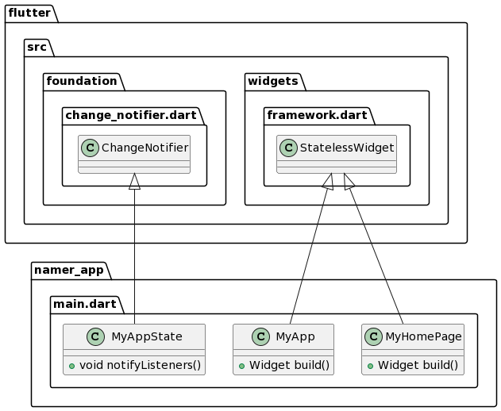
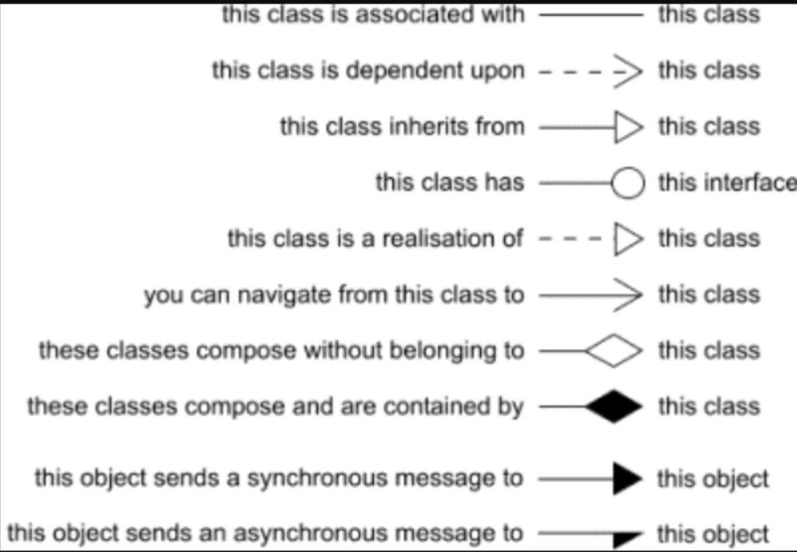

# UML Analyse von bestehenden Flutterprogrammen

## Erstellung eines UML Diagramms von einer App
1) Installation
https://pub.dev/packages/dcdg/install

2) Ausführung in Terminal (in VS Code)

```Flutter pub global run dcdg```

3) Den Code hier koopieren
https://www.plantuml.com/plantuml/uml

4) Das Ergebnis sieht z.B. so aus (für die Layout-App https://github.com/bernhardstandl/softwarepraktikum/blob/main/materialien/layout.md)


## UML Wiederholung 
In der Entwicklung mit Flutter handelt es sich bei einem UML-Analysemodell um eine visuelle Darstellung des Designs und der Struktur der Klassen in einer Flutter-Anwendung. Ein UML-Analysemodell für Flutter-Klassen besteht aus verschiedenen Diagrammen, die die verschiedenen Aspekte der Klassenstruktur und ihrer Beziehungen beschreiben. Das Klassendiagramm ist das grundlegende Diagramm in einem UML-Analysemodell. Es zeigt die Klassen und deren Attribute, Methoden und Beziehungen zueinander. Jede Klasse wird durch ein Rechteck dargestellt, das den Klassennamen enthält. Attribute werden unterhalb des Namens aufgeführt, und Methoden werden darunter aufgeführt. Beziehungen zwischen den Klassen werden durch Linien und Pfeile dargestellt.
* **Attribute**: Attribute sind Eigenschaften oder Daten, die einer Klasse zugeordnet sind. Sie werden normalerweise im Klassendiagramm aufgeführt und beschreiben den Zustand einer Klasse. Beispiele für Attribute in einer Flutter-Klasse könnten sein: "Farbe", "Größe" oder "Text".
* **Methoden**: Methoden sind Aktionen oder Funktionen, die eine Klasse ausführen kann. Sie werden ebenfalls im Klassendiagramm aufgeführt und beschreiben das Verhalten einer Klasse. In Flutter könnten Methoden wie "zeichnen()", "aktualisieren()" oder "löschen()" definiert werden.
* **Beziehungen**: Beziehungen zwischen den Klassen zeigen, wie sie miteinander interagieren. Es gibt verschiedene Arten von Beziehungen, die im UML-Analysemodell dargestellt werden können, wie z.B. Assoziationen, Aggregationen, Kompositionen und Vererbungen. Diese Beziehungen werden durch Pfeile und Multipizitäten dargestellt und helfen dabei, das Zusammenspiel der Klassen zu verstehen.
* **Vererbung**: Vererbung ist eine spezielle Beziehung zwischen Klassen, bei der eine Klasse (die sogenannte "Unterklasse" oder "abgeleitete Klasse") Eigenschaften und Methoden von einer anderen Klasse (der "Superklasse" oder "Basisklasse") erbt. Diese Beziehung wird im Klassendiagramm durch einen Pfeil mit einem leeren Dreieck am Ende dargestellt.
* **Abstrakte Klassen und Schnittstellen**: Abstrakte Klassen und Schnittstellen sind spezielle Arten von Klassen, die als Vorlage für andere Klassen dienen. Abstrakte Klassen können nicht direkt instanziiert werden und enthalten oft abstrakte Methoden, die von den abgeleiteten Klassen implementiert werden müssen. Schnittstellen definieren eine Sammlung von Methoden, die eine Klasse implementieren kann. Beide können im Klassendiagramm dargestellt werden.



